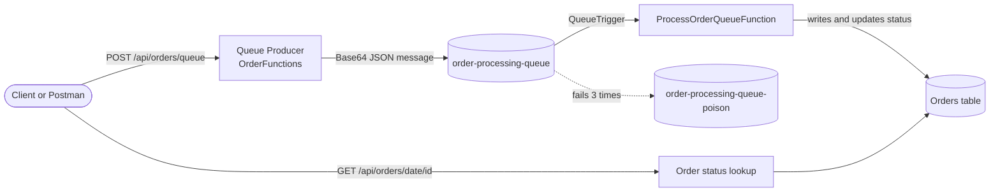
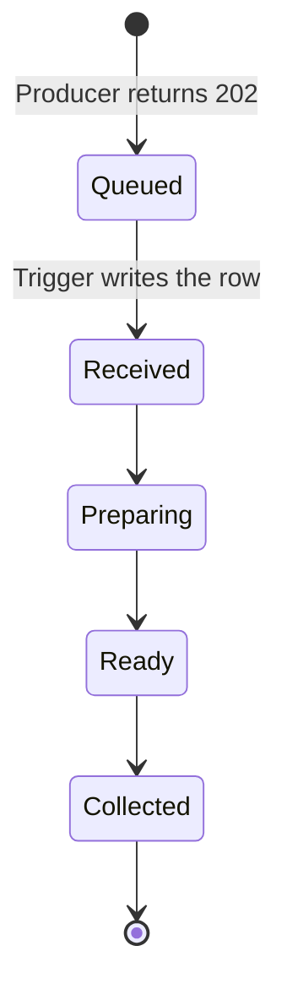
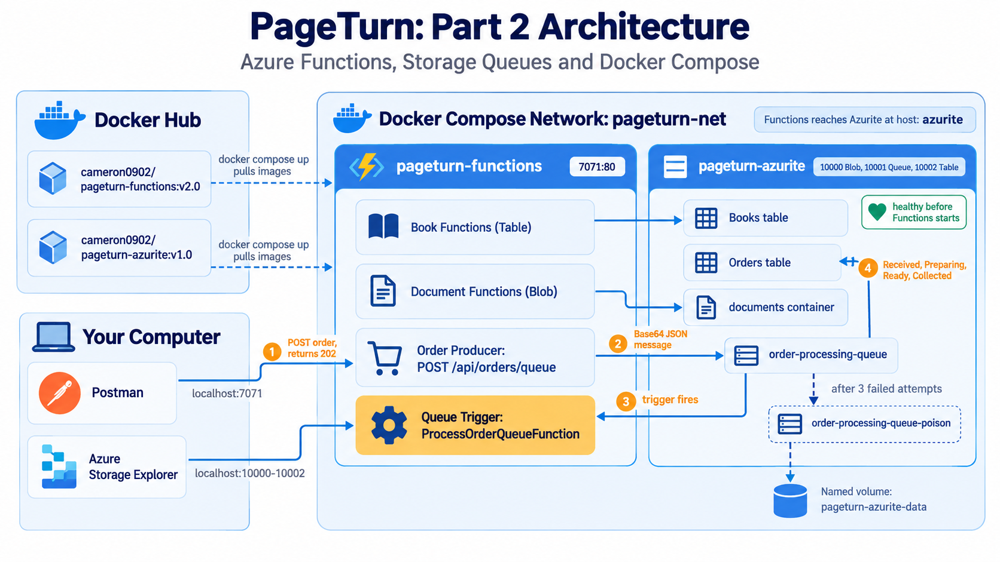

<p align="center">
  
</p>

<h1 align="center">PageTurn</h1>
<h3 align="center">Cloud Development B (CLDV6212) - Portfolio of Evidence, Part 2</h3>
<h4 align="center">Azure Storage Queues, Queue Triggered Functions, and Docker Compose</h4>

<p align="center">
  <a href="https://dotnet.microsoft.com/"></a>
  <a href="https://learn.microsoft.com/azure/azure-functions/"></a>
  <a href="https://learn.microsoft.com/azure/storage/queues/"></a>
  <a href="https://docs.docker.com/compose/"></a>
  <a href="https://hub.docker.com/u/cameron0902"></a>
  <a href="https://github.com/Azure/Azurite"></a>
  <a href="https://www.postman.com/"></a>
  
  
</p>

## App Demo

<p align="center">
  <a href="https://youtu.be/REPLACE_WITH_YOUR_VIDEO_ID">
    
  </a>
</p>

<p align="center">
  <em>The video shows the single command <code>docker compose up</code> startup, messages landing in the queue, live status updates in the Orders table, and the full Postman collection running.</em>
</p>

---

## Team Member Details

| Name | Student Number | Primary Contribution Area |
|---|---|---|
| Member 1 | STXXXXXXXX | Project scaffolding, Dockerfile, Docker Compose, Docker Hub publishing, README |
| Member 2 | STXXXXXXXX | Queue producer endpoint, validation, and queue service |
| Member 3 | STXXXXXXXX | Queue triggered function, Orders table, and Postman test suite |

---

## Table of Contents

- [Team Member Details](#team-member-details)
- [Overview](#overview)
- [Changelog](#changelog)
- [Rubric Coverage Summary](#rubric-coverage-summary)
- [Architecture](#architecture)
- [Technology Stack](#technology-stack)
- [Project Structure](#project-structure)
- [Local Setup](#local-setup)
- [Running with Docker Compose](#running-with-docker-compose)
- [Docker Hub Images](#docker-hub-images)
- [API Reference and Implementation Detail](#api-reference-and-implementation-detail)
- [Queue Producer in Detail](#queue-producer-in-detail)
- [Queue Trigger in Detail](#queue-trigger-in-detail)
- [Error Handling Strategy](#error-handling-strategy)
- [Software Engineering Practices](#software-engineering-practices)
- [Testing with Postman](#testing-with-postman)
- [Assumptions](#assumptions)
- [Future Implementation](#future-implementation)
- [Known Platform Considerations](#known-platform-considerations)
- [Code Attributions](#code-attributions)
- [AI Usage Declaration](#ai-usage-declaration)
- [Contributors](#contributors)
- [Team Contributions in Detail](#team-contributions-in-detail)

---

## Overview

PageTurn is a campus bookshop backend built for the CLDV6212 Cloud Development B
module. Part 1 delivered a serverless Azure Functions API for managing the book
catalogue in Azure Table Storage and campus documents in Azure Blob Storage,
containerised as standalone Docker images.

Part 2 extends that system with an **asynchronous order pipeline**. Instead of
processing an order inside the HTTP request, the API now places the order on an
Azure Storage Queue and returns immediately. A queue triggered function picks the
message up in the background, records the order in an Azure Table, and moves it
through its lifecycle from `Received` to `Collected`.

The whole system, the Functions app and the Azurite storage emulator, now starts
with a single command, `docker compose up`, pulling both images straight from Docker
Hub. As in Part 1, Azure Blob Storage is used in place of Azure File Storage,
because Azurite does not emulate File Storage.

---

## Changelog

### v2.0 - Part 2 (current)

**Added**
- Queue producer endpoint, `POST /api/orders/queue`, which validates the order, serialises it to JSON, Base64 encodes it, and places it on `order-processing-queue`. It returns `202 Accepted`.
- Queue triggered function, `ProcessOrderQueueFunction`, which fires as soon as a message arrives and writes the order to the `Orders` table with status `Received`.
- Simulated status lifecycle: `Received`, `Preparing`, `Ready`, `Collected`, with a configurable delay between steps.
- Order status endpoints: `GET /api/orders/{orderDate}/{orderId}` and `GET /api/orders?date=yyyy-MM-dd`.
- Poison queue handling: after three failed attempts a message moves to `order-processing-queue-poison`.
- `docker-compose.yml` orchestrating Azurite and the Functions host, using images pulled from Docker Hub, with a health check, a bridge network, and a named volume.
- Server generated UTC timestamps on every queued order.
- Postman folder `03 - Orders` with positive and negative tests for the full queue flow.

**Changed**
- Functions image re-published to Docker Hub as `v2.0`, with a matching `v2.0.0` tag.
- Postman collection extended from Part 1 rather than replaced.

**Unchanged from Part 1 (`v1.0`)**
- Book catalogue endpoints on Azure Table Storage.
- Document endpoints on Azure Blob Storage.
- Azurite image, published as `v1.0`.

---

## Rubric Coverage Summary

This section maps each Part 2 rubric category to where it is satisfied in this
repository and in this document, so every requirement can be checked in one place
before submission.

| Rubric Category | Marks | Where It Is Addressed |
|---|---|---|
| Azure Storage Queue Placement (Order Producer) | 25 | [Queue Producer in Detail](#queue-producer-in-detail), `Functions/OrderFunctions.cs`, `Services/OrderQueueService.cs`, `Models/Dtos/OrderDtos.cs` |
| Queue Triggered Function and Orders Table | 25 | [Queue Trigger in Detail](#queue-trigger-in-detail), `Functions/ProcessOrderQueueFunction.cs`, `Services/OrderService.cs`, `Models/Entities/OrderEntity.cs`, `Models/OrderStatus.cs` |
| Multi-Container Orchestration (Docker Compose) | 25 | [Running with Docker Compose](#running-with-docker-compose), [Docker Hub Images](#docker-hub-images), `docker-compose.yml` |
| Video Presentation and Queue Testing | 15 | [App Demo](#app-demo), [Testing with Postman](#testing-with-postman), `docs/PageTurn.postman_collection.json` |
| Version Control and Repository Progress | 10 | [Team Contributions in Detail](#team-contributions-in-detail), the repository commit history and feature branches |
| GitHub Usage Penalty (up to -5 if incorrect) | N/A | Public repository, all members as contributors, verifiable commit history |

---

## Architecture

The system is made up of two containers on one Docker network. The Functions app
talks to Azurite by its service name, `azurite`, never by `127.0.0.1`.

| Component | Responsibility | Storage Backing |
|---|---|---|
| PageTurn Functions | HTTP triggered functions (Books, Documents, Orders) and the queue triggered order processor | Not applicable |
| Azurite | Local emulation of Azure Table, Blob, and Queue Storage | `Books` and `Orders` tables, `documents` container, `order-processing-queue` and its poison queue |

### Order flow



### Order status lifecycle



`Queued` is what the producer reports to the client. `Received` is the first status
stored in the Orders table, as required by the brief.

<p align="center">
  
  <br>
  <em>PageTurn architecture: Functions host, Azurite, and the order queue, all inside the Docker Compose network.</em>
</p>

### Data model

| Store | Key design |
|---|---|
| `Books` table | PartitionKey is the book category and RowKey is the SKU, so category queries stay inside one partition |
| `Orders` table | PartitionKey is the order date (`yyyy-MM-dd`) and RowKey is the OrderId, as the brief specifies |
| `documents` container | Campus documents stored as blobs, streamed in and out |
| `order-processing-queue` | Base64 encoded JSON order messages |

---

## Technology Stack

- .NET 10, Azure Functions Isolated Worker model with ASP.NET Core integration
- Azure.Data.Tables, the Table Storage client SDK
- Azure.Storage.Blobs, the Blob Storage client SDK
- Azure.Storage.Queues, the Queue Storage client SDK
- Microsoft.Azure.Functions.Worker.Extensions.Storage.Queues, the queue trigger binding
- Azurite, the local Azure Storage emulator
- Docker, multi-stage build, and Docker Compose
- Docker Hub, for image publishing and version tags
- Postman, for the automated API test suite

---

## Project Structure

The tree shows source files only. The `bin` and `obj` folders are excluded, since they
are compiler output listed in `.gitignore`.

```
PageTurn.Functions/
│   .dockerignore
│   .env
│   .gitignore
│   docker-compose.yml
│   Dockerfile
│   host.json
│   local.settings.json           (not committed, see .gitignore)
│   PageTurn.Functions.csproj
│   Program.cs
│   README.md
│
├───docs
│       PageTurn.postman_collection.json
│
├───Functions
│       BookFunctions.cs
│       DocumentFunctions.cs
│       OrderFunctions.cs
│       ProcessOrderQueueFunction.cs
│
├───Helpers
│   │   ApiResults.cs
│   │   DocumentValidator.cs
│   │   JsonDefaults.cs
│   │   RequestReader.cs
│   │
│   └───Constants
│           StorageNames.cs
│           ValidationPatterns.cs
│
├───Models
│   │   OrderStatus.cs
│   │
│   ├───Dtos
│   │       BookDtos.cs
│   │       DocumentDtos.cs
│   │       OrderDtos.cs
│   │
│   └───Entities
│           BookEntity.cs
│           OrderEntity.cs
│
├───screenshots
│       (images used by this README)
│
└───Services
        BookService.cs
        DocumentService.cs
        OrderQueueService.cs
        OrderService.cs
```

Functions only translate HTTP requests into service calls. Services own the storage
logic. Models describe data. Helpers hold shared pieces such as response builders and
validators.

---

## Local Setup

These steps run the Functions app directly, outside Docker, against a locally running
Azurite instance. This is the fastest workflow during development.

### Prerequisites

- Visual Studio 2026 or later, with the Azure Functions workload installed
- .NET 10 SDK
- Docker Desktop, with the WSL2 backend enabled on Windows
- Azure Storage Explorer, optional but recommended for inspecting queues and tables
- Postman, to run the test collection

### Step 1: Start Azurite

```bash
docker run -d --name azurite -p 10000:10000 -p 10001:10001 -p 10002:10002 mcr.microsoft.com/azure-storage/azurite
```

### Step 2: Configure local settings

Create `local.settings.json` in the project root.

```json
{
  "IsEncrypted": false,
  "Values": {
    "AzureWebJobsStorage": "UseDevelopmentStorage=true",
    "FUNCTIONS_WORKER_RUNTIME": "dotnet-isolated",
    "BooksTableName": "Books",
    "OrdersTableName": "Orders",
    "DocumentsContainerName": "documents",
    "OrderQueueName": "order-processing-queue",
    "MaxUploadSizeBytes": "10485760",
    "StatusTransitionDelaySeconds": "3"
  }
}
```

### Step 3: Run the Functions host

```bash
func start
```

Or press F5 in Visual Studio. On startup the console lists every HTTP endpoint and the
queue triggered function.

<p align="center">
  
  <br>
  <em>The Functions host started locally, listing the HTTP endpoints and the queue triggered function.</em>
</p>

### Step 4: Verify

```bash
curl "http://localhost:7071/api/orders?date=2026-10-06"
```

A `200` response confirms the app is running and connected to Azurite.

---

## Running with Docker Compose

Part 2 requires the whole system to start with one command. The compose file lives in
the root of the repository and references the published Docker Hub images. There is no
`build:` path anywhere in it.

### The single command

```bash
docker compose up -d
```

Docker pulls both images from Docker Hub, creates the network and volume, starts Azurite,
waits until it is healthy, and then starts the Functions host.

<p align="center">
  
  <br>
  <em>One command pulls both images from Docker Hub and starts the full system.</em>
</p>

### Confirm both containers are healthy

```bash
docker compose ps
```

<p align="center">
  
  <br>
  <em>Both containers report <code>healthy</code> before any request is sent.</em>
</p>

### What the compose file does

| Feature | Why it matters |
|---|---|
| `image: cameron0902/pageturn-functions:v2.0` and `image: cameron0902/pageturn-azurite:v1.0` | Uses the published Docker Hub images, as the brief requires |
| `pull_policy: always` | Always fetches from Docker Hub, which proves the publish worked |
| `healthcheck` on Azurite and `depends_on: condition: service_healthy` | The Functions host starts only once storage is ready |
| Custom bridge network, `pageturn-net` | Containers reach each other by service name |
| Named volume, `pageturn-azurite-data` | Storage data survives container restarts |
| Connection string uses the host `azurite`, not `127.0.0.1` | Inside a container, `127.0.0.1` is the container itself |
| Port `7071:80` for Functions and `10000-10002` for Azurite | Postman and Storage Explorer connect from the host |

### Useful commands

```bash
docker compose logs -f functions     # follow the Functions logs
docker compose stop                  # stop, keep containers
docker compose down                  # stop and remove containers and network, keep the volume
docker compose down -v               # also delete the Azurite data volume
```

---

## Docker Hub Images

Both images are published publicly under the following Docker Hub account.

**Docker Hub profile: [https://hub.docker.com/u/cameron0902](https://hub.docker.com/u/cameron0902)**

| Image | Tags | Live Repository Link |
|---|---|---|
| PageTurn Functions | `v1.0` (Part 1), `v2.0` and `v2.0.0` (Part 2) | [https://hub.docker.com/r/cameron0902/pageturn-functions](https://hub.docker.com/r/cameron0902/pageturn-functions) |
| Azurite, re-published | `v1.0` | [https://hub.docker.com/r/cameron0902/pageturn-azurite](https://hub.docker.com/r/cameron0902/pageturn-azurite) |

### Pulling both images

Both repositories are public and can be pulled without logging in.

```bash
docker pull cameron0902/pageturn-functions:v2.0
docker pull cameron0902/pageturn-azurite:v1.0
```

### How the Part 2 image was built and published

```bash
docker build -t cameron0902/pageturn-functions:v2.0 -t cameron0902/pageturn-functions:v2.0.0 .

docker login

docker push cameron0902/pageturn-functions:v2.0
docker push cameron0902/pageturn-functions:v2.0.0
```

<p align="center">
  
  <br>
  <em>Building the Part 2 Functions image from the multi-stage Dockerfile, with two version tags.</em>
</p>

<p align="center">
  
  <br>
  <em>Pushing both version tags to Docker Hub.</em>
</p>

### Confirming the images are live

<p align="center">
  
  <br>
  <em>The public Docker Hub repository showing the v1.0 and v2.0 tags.</em>
</p>

### Standalone execution (Part 1 requirement, still supported)

The Functions image also runs on its own without Compose.

```bash
docker network create pageturn-net

docker run -d --name azurite --network pageturn-net -p 10000:10000 -p 10001:10001 -p 10002:10002 cameron0902/pageturn-azurite:v1.0

docker run -d --name pageturn-app -p 7071:80 --network pageturn-net \
  -e AzureWebJobsStorage="DefaultEndpointsProtocol=http;AccountName=devstoreaccount1;AccountKey=Eby8vdM02xNOcqFlqUwJPLlmEtlCDXJ1OUzFT50uSRZ6IFsuFq2UVErCz4I6tq/K1SZFPTOtr/KBHBeksoGMGw==;BlobEndpoint=http://azurite:10000/devstoreaccount1;QueueEndpoint=http://azurite:10001/devstoreaccount1;TableEndpoint=http://azurite:10002/devstoreaccount1;" \
  -e FUNCTIONS_WORKER_RUNTIME="dotnet-isolated" \
  cameron0902/pageturn-functions:v2.0
```

The account key above is the publicly documented Azurite development key. It is not a secret.

---

## API Reference and Implementation Detail

### Order Endpoints, new in Part 2

| Method | Route | Description | Success |
|---|---|---|---|
| POST | `/api/orders/queue` | Validate an order and place it on `order-processing-queue` | `202 Accepted` |
| GET | `/api/orders/{orderDate}/{orderId}` | Retrieve one order and its current status | `200 OK` |
| GET | `/api/orders?date=yyyy-MM-dd` | List the orders for one date | `200 OK` |

**Request body for `POST /api/orders/queue`**

```json
{
  "OrderId": "ORD-2026-1001",
  "CustomerName": "Jane Smith",
  "SelectedItemSKUs": ["TXT-001", "NOV-001"],
  "TotalPrice": 65.00,
  "OrderTimestamp": "2026-10-06T09:00:00Z"
}
```

**Response, `202 Accepted`**

```json
{
  "orderId": "ORD-2026-1001",
  "status": "Queued",
  "message": "Order accepted and waiting to be processed.",
  "statusUrl": "/api/orders/2026-10-06/ORD-2026-1001"
}
```

The `statusUrl` tells the client exactly where to check on the order later.

<p align="center">
  
  <br>
  <em>A valid order accepted with a 202 and a status URL.</em>
</p>

### Book Endpoints, backed by Azure Table Storage (from Part 1)

| Method | Route | Description |
|---|---|---|
| POST | `/api/books` | Create a book |
| GET | `/api/books` | Retrieve all books |
| GET | `/api/books/category/{category}` | Retrieve books in a category |
| PUT | `/api/books/{category}/{id}` | Update a book |
| DELETE | `/api/books/{category}/{id}` | Delete a book |

### Document Endpoints, backed by Azure Blob Storage (from Part 1)

| Method | Route | Description |
|---|---|---|
| POST | `/api/documents/upload` | Upload a document as multipart form data |
| GET | `/api/documents` | List stored documents |
| GET | `/api/documents/download/{fileName}` | Download a document |

Uploads are validated for size, file extension, and declared content type before any
data reaches Blob Storage. Unsafe file names are rejected with a `400`.

---

## Queue Producer in Detail

The producer is the HTTP function that accepts an order and places it on the queue. It
does the cheap checks first and touches storage last.

1. **Read the body safely.** A request reader handles empty bodies and malformed JSON, returning `400` instead of throwing.
2. **Validate every field.** DataAnnotations check each field, and `IValidatableObject` checks rules that span fields.
3. **Generate the timestamp on the server.** The queued message carries a UTC timestamp created by the API, not a value the client can fake.
4. **Serialise to JSON and Base64 encode.** The trigger decodes the same format, so the two sides always agree.
5. **Send to `order-processing-queue`.** The queue is created if it does not exist.
6. **Return `202 Accepted`.** The work is not finished yet, so `200` would be wrong.

**Validation rules**

| Field | Rule |
|---|---|
| `OrderId` | Required, must match the pattern `ORD-YYYY-NNNN` |
| `CustomerName` | Required, length limited |
| `SelectedItemSKUs` | At least one SKU, each SKU in a valid format |
| `TotalPrice` | Greater than zero, upper limit applied |
| `OrderTimestamp` | Valid ISO 8601 date and time |

**The queue message contract**

The producer and the trigger share one set of property names. If they differed, fields
would arrive as `null` in the trigger.

```json
{
  "OrderId": "ORD-2026-1001",
  "CustomerName": "Jane Smith",
  "SelectedItemSKUs": ["TXT-001", "NOV-001"],
  "TotalPrice": 65.00,
  "OrderTimestamp": "2026-10-06T09:00:00Z"
}
```

<p align="center">
  
  <br>
  <em>A message waiting in <code>order-processing-queue</code>, shown in Azure Storage Explorer.</em>
</p>

---

## Queue Trigger in Detail

`ProcessOrderQueueFunction` runs automatically whenever a message arrives on
`order-processing-queue`.

1. **Decode and parse.** The Base64 message is decoded and the JSON is parsed into an order object.
2. **Create the Orders row.** PartitionKey is the order date, RowKey is the OrderId, and the status is `Received`.
3. **Treat duplicates as already done.** If the row already exists (`409 Conflict` from Table Storage), the function does not create a second one. This makes the trigger **idempotent**, which matters because queues can deliver a message more than once.
4. **Move through the lifecycle.** The status changes `Received`, then `Preparing`, then `Ready`, then `Collected`, waiting `StatusTransitionDelaySeconds` between steps.
5. **Handle failure.** If processing throws, the exception is rethrown so the runtime retries the message.

### Retries and the poison queue

```json
{
  "version": "2.0",
  "extensions": {
    "queues": {
      "maxDequeueCount": 3
    }
  }
}
```

After three failed attempts, the runtime moves the message to
`order-processing-queue-poison`, so one bad message cannot block the rest of the queue.

### Why the message disappears quickly

The trigger picks up a message within about a second, so a message is only visible in
the queue for a very short time. The five second delay in the Docker Compose setup is
the pause between status changes, not the time to pick up the message.

<p align="center">
  
  <br>
  <em>The Orders table row written by the queue trigger, with PartitionKey as the date and RowKey as the OrderId.</em>
</p>

<p align="center">
  
  <br>
  <em>Function logs showing the order being received and moved through each status.</em>
</p>

---

## Error Handling Strategy

Every endpoint returns a status code that reflects the actual outcome.

| Status Code | Meaning in this project | Where it is used |
|---|---|---|
| 200 OK | The request succeeded | Successful GET, PUT, and DELETE requests |
| 201 Created | A new resource was created | Creating a book or uploading a document |
| 202 Accepted | The request was accepted for background processing | `POST /api/orders/queue` |
| 400 Bad Request | The request failed validation | Missing fields, an invalid OrderId, an empty SKU list, malformed JSON, a bad date format, or a disallowed file |
| 404 Not Found | The resource does not exist | Looking up an order, book, or document that is not there |
| 409 Conflict | The resource already exists | Creating a duplicate book |
| 503 Service Unavailable | Storage cannot be reached | Placing an order while Azurite is down |
| 500 Internal Server Error | An unexpected failure | Any unhandled error, logged with its full exception |

**Why 503 and not 500 for storage failures.** A storage outage is a temporary condition
outside the application's own logic. `503` tells the client the service is unavailable
and a retry may work, and the message is readable rather than a stack trace.

<p align="center">
  
  <br>
  <em>With Azurite stopped, the producer returns a clean 503 instead of crashing.</em>
</p>

---

## Software Engineering Practices

- **Separation of concerns.** Functions handle HTTP only, Services handle storage, Models define data, and Helpers hold shared code. No function talks to a storage client directly.
- **Dependency injection.** Services are registered once in `Program.cs`, and the queue, table, and blob clients are reused for the life of the app.
- **DTOs kept apart from entities.** The public request contract never exposes storage details such as ETag or PartitionKey.
- **Input validation.** DataAnnotations plus `IValidatableObject`, run explicitly before any storage call.
- **Constants in one place.** Table, queue, and container names and validation patterns live in `Helpers/Constants`, so there are no magic strings scattered through the code.
- **Consistent responses.** `ApiResults` builds every error response in one shape.
- **Idempotent processing.** The queue trigger tolerates duplicate delivery.
- **Configuration through settings.** Queue and table names, upload size, and the status delay come from app settings, not from code.
- **Structured logging.** Information on success, warnings on expected failures, and errors with the full exception on unexpected ones.
- **Async I/O throughout.** Every storage call uses `async` and `await`.
- **Multi-stage Dockerfile.** The SDK image builds the app and the runtime image only carries the published output, which keeps the final image smaller.

---

## Testing with Postman

The collection `docs/PageTurn.postman_collection.json` covers every endpoint, including
the new queue flow. It uses a `{{baseUrl}}` variable on every request, so there are no
hardcoded URLs.

### Collection layout

| Folder | What it tests |
|---|---|
| `00 - Setup` | Idempotent cleanup before a run |
| `01 - Books (Table Storage)` | Create, read, update, delete, category filter, duplicates, validation failures |
| `02 - Documents (Blob Storage)` | Upload, list, download, unsafe file names, missing files |
| `03 - Orders (Queue + Table)` | Place an order, verify the Orders table, and the negative tests below |

### Collection variables

| Variable | Purpose |
|---|---|
| `baseUrl` | `http://localhost:7071/api`, used by every request |
| `orderId` | Generated fresh by a pre-request script on each run |
| `orderDate` | Saved from the `statusUrl` by the Tests tab, then used by the next request |
| `processingWaitMs` | How long to wait for the trigger before checking the status (`18000` under Docker Compose) |

<p align="center">
  
  <br>
  <em>The collection variables, with <code>baseUrl</code> used by every request.</em>
</p>

### How requests pass information to each other

Request `3.01 Place Order - valid` creates a unique OrderId in its pre-request script and
checks the `202` response. It then reads the date out of the `statusUrl` and saves it to
`orderDate`. The next request uses `{{orderDate}}` and `{{orderId}}` to fetch the order,
waits long enough for the trigger to finish, and checks that the status reached
`Collected` and that the stored data matches what was sent.

### Order tests

| Request | Expected result |
|---|---|
| Place Order, valid | `202`, status `Queued`, `statusUrl` present |
| Get order after processing | `200`, status `Collected`, stored data matches |
| List orders by date | `200`, the order appears in the list |
| OrderId = `"123"` | `400`, the error mentions `OrderId` |
| Empty `SelectedItemSKUs` | `400`, at least one SKU required |
| Malformed JSON body | `400` |
| Empty body | `400` |
| Order that does not exist | `404` |
| Date in the wrong format, `01-10-2026` | `400`, expects `yyyy-MM-dd` |
| Azurite stopped, then place an order | `503`, readable message |

<p align="center">
  
  <br>
  <em>The full collection run through the Collection Runner, with the automated tests passing.</em>
</p>

<p align="center">
  
  <br>
  <em>An invalid OrderId rejected with a 400 and a list of errors. Nothing was added to the queue.</em>
</p>

### Running the collection

1. Start the system with `docker compose up -d` and wait until `docker compose ps` shows both containers healthy.
2. Import `docs/PageTurn.postman_collection.json` into Postman.
3. Check the collection variable `baseUrl` is `http://localhost:7071/api` and set `processingWaitMs` to `18000`.
4. Open the Collection Runner, choose the collection (or just the `03 - Orders` folder), and click Run.
5. Demonstrate the `503` manually: run `docker stop pageturn-azurite`, send a valid order, confirm the `503`, then run `docker start pageturn-azurite`.
6. Document uploads need a real file attached under the request's Body tab, because Postman does not save file bytes in an exported collection.

---

## Assumptions

- Authentication and authorisation are out of scope for this part, so every endpoint uses `AuthorizationLevel.Anonymous`.
- Orders reference SKUs by format only. The producer does not check that each SKU exists in the `Books` table.
- The order lifecycle is simulated with a timed delay. A real system would be driven by events from the shop floor.
- Local development and grading run against Azurite, not a live Azure Storage account.
- The Azurite development storage key appears in configuration files. It is a publicly documented key that only works against the local emulator, so it is not a secret. This would not be acceptable for a real storage account.
- One fixed queue, one Orders table, and one document container are enough for this submission.

---

## Future Implementation

- Add authentication and role-based authorisation for order and catalogue endpoints.
- Check each ordered SKU against the `Books` table and reduce stock when an order is collected.
- Replace the simulated delays with real status updates from a staff-facing endpoint.
- Add a function that reads the poison queue and alerts staff, or lets them replay a failed order.
- Add pagination to the list endpoints.
- Add integration tests against an ephemeral Azurite instance in a CI pipeline.
- Publish the images from a GitHub Actions workflow instead of by hand.

---

## Known Platform Considerations

**Docker Desktop must be running.** `docker compose up` fails with an error about the Docker engine pipe if Docker Desktop is not started. Start Docker Desktop and wait for "Engine running" first.

**`pull_policy: always` overwrites local builds.** Because the compose file always pulls from Docker Hub, a locally built image with the same tag is replaced by the one on Docker Hub. To test local changes, push the new image first, or run `docker compose up -d --pull never` while testing.

**Use the service name, not localhost, between containers.** Inside a container `127.0.0.1` points at the container itself, so the Functions app reaches Azurite at `azurite`.

**The queue is consumed quickly.** The trigger takes messages within a second or so. To show a message sitting in the queue, stop the Functions container with `docker stop pageturn-functions`, send the order, view it in Storage Explorer, then run `docker start pageturn-functions`.

**Azurite does not emulate Azure File Storage.** Blob Storage is used instead, as allowed by the module addendum.

**Postman file attachments do not survive export or import.** Document upload requests need their file reattached after importing the collection.

---

## Code Attributions

- **Isolated Worker Functions Host:**
  - Author: Microsoft
  - Link: [Guide for running C# Azure Functions in an isolated worker process](https://learn.microsoft.com/en-us/azure/azure-functions/dotnet-isolated-process-guide)
  - Date Accessed: [DD Month 2026]

- **Azure Queue Storage Client Library for .NET:**
  - Author: Microsoft
  - Link: [Quickstart: Azure Queue Storage client library for .NET](https://learn.microsoft.com/en-us/azure/storage/queues/storage-quickstart-queues-dotnet)
  - Date Accessed: [DD Month 2026]

- **Azure Queue Storage Trigger and Poison Messages:**
  - Author: Microsoft
  - Link: [Azure Queue storage trigger and bindings for Azure Functions](https://learn.microsoft.com/en-us/azure/azure-functions/functions-bindings-storage-queue-trigger)
  - Date Accessed: [DD Month 2026]

- **Azure.Data.Tables Client Library:**
  - Author: Microsoft
  - Link: [Azure.Data.Tables client library for .NET](https://learn.microsoft.com/en-us/dotnet/api/overview/azure/data.tables-readme)
  - Date Accessed: [DD Month 2026]

- **Azure Blob Storage Client Library:**
  - Author: Microsoft
  - Link: [Get started with Azure Blob Storage and .NET](https://learn.microsoft.com/en-us/azure/storage/blobs/storage-blob-dotnet-get-started)
  - Date Accessed: [DD Month 2026]

- **Dependency Injection in .NET:**
  - Author: Microsoft
  - Link: [Dependency injection in .NET](https://learn.microsoft.com/en-us/dotnet/core/extensions/dependency-injection)
  - Date Accessed: [DD Month 2026]

- **Data Annotations for Validation:**
  - Author: Microsoft
  - Link: [System.ComponentModel.DataAnnotations Namespace](https://learn.microsoft.com/en-us/dotnet/api/system.componentmodel.dataannotations)
  - Date Accessed: [DD Month 2026]

- **Azurite Emulator:**
  - Author: Microsoft
  - Link: [Use the Azurite emulator for local Azure Storage development](https://learn.microsoft.com/en-us/azure/storage/common/storage-use-azurite)
  - Date Accessed: [DD Month 2026]

- **Docker Compose Startup Order and Health Checks:**
  - Author: Docker Inc.
  - Link: [Control startup and shutdown order in Compose](https://docs.docker.com/compose/how-tos/startup-order/)
  - Date Accessed: [DD Month 2026]

- **Docker Multi-Stage Builds:**
  - Author: Docker Inc.
  - Link: [Multi-stage builds](https://docs.docker.com/build/building/multi-stage/)
  - Date Accessed: [DD Month 2026]

- **Postman Test Scripts and Variables:**
  - Author: Postman Inc.
  - Link: [Write test scripts in Postman](https://learn.postman.com/docs/tests-and-scripts/write-scripts/test-scripts/)
  - Date Accessed: [DD Month 2026]

- **HTTP 202 Accepted:**
  - Author: MDN Web Docs, Mozilla
  - Link: [202 Accepted](https://developer.mozilla.org/en-US/docs/Web/HTTP/Status/202)
  - Date Accessed: [DD Month 2026]

---

## AI Usage Declaration

[Replace this paragraph with your group's declaration, in line with the Institute's AI policy. State which tool was used, what it was used for, and confirm that every member reviewed, understood, and tested the code they submitted.]

---

## Contributors

<table>
  <tr>
    <td align="center">
      <a href="https://github.com/MEMBER1_USERNAME">
        
        <br />
        <sub><b>Member 1</b></sub>
      </a>
      <br/>
      <sub>STXXXXXXXX</sub>
      <br/>
      <a href="mailto:STXXXXXXXX@myemeris.edu.za">STXXXXXXXX@myemeris.edu.za</a>
    </td>
    <td align="center">
      <a href="https://github.com/MEMBER2_USERNAME">
        
        <br />
        <sub><b>Member 2</b></sub>
      </a>
      <br/>
      <sub>STXXXXXXXX</sub>
      <br/>
      <a href="mailto:STXXXXXXXX@myemeris.edu.za">STXXXXXXXX@myemeris.edu.za</a>
    </td>
    <td align="center">
      <a href="https://github.com/MEMBER3_USERNAME">
        
        <br />
        <sub><b>Member 3</b></sub>
      </a>
      <br/>
      <sub>STXXXXXXXX</sub>
      <br/>
      <a href="mailto:STXXXXXXXX@myemeris.edu.za">STXXXXXXXX@myemeris.edu.za</a>
    </td>
  </tr>
</table>

---

## Team Contributions in Detail

**Member 1 (STXXXXXXXX)**
Responsible for project scaffolding and package configuration, the multi-stage
Dockerfile, the `docker-compose.yml` file, building and publishing both images to Docker
Hub with their version tags, and authoring this README.

**Member 2 (STXXXXXXXX)**
Responsible for the queue producer, including the order DTOs and validation rules, the
`OrderQueueService` with Base64 encoding and server generated timestamps, the
`OrderFunctions` HTTP endpoints, and the mapping of storage failures to `400`, `202`, and
`503` responses.

**Member 3 (STXXXXXXXX)**
Responsible for the queue triggered `ProcessOrderQueueFunction`, the `OrderService` and
`OrderEntity` for the Orders table, the status lifecycle, retry and poison queue
configuration, and the Postman test suite for the full order flow, including the negative
tests.

Individual contribution is further reflected in the commit history of this repository,
with each member committing to their own feature branch before merging into `main`.

---

<p align="center">
  <sub>CLDV6212, Cloud Development B, The Independent Institute of Education</sub>
</p>
